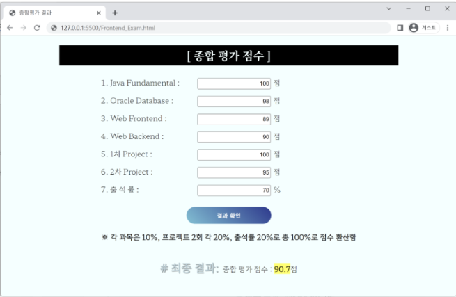

※ 주어진 *.html을 이용하여 문제를 해결한 후 *.html, *.js, *.css 파일을 분리하여 작성하고, 아래와 같이 압축하여
지정된 드라이브로 업로드 하시오. (업로드는 1회에 한해서 가능.)
KD2기_홍길동.zip
[결과 화면]

1) 기능 요구사항
1 최종 파일은 3개 (*.html, *.css, *.js)로 분리하여 작성한다. (5점)
2 7개의 과목은 0~100사이의 점수로 입력 받는다.
점수 범위를 벗어나거나 문자열이 입력될 경우 경고창 출력 (25점)
3 “결과 확인” 버튼을 클릭하면 종합점수가 출력된다. (25점)
종합점수 = 각 과목은 10% + 프로젝트 2회 20% + 출석률 20%

2) 디자인 요구사항 : 크기와 글꼴, 색상은 임의의 값을 사용한다.
1 웹 문서 전체 배경색 지정 (5점)
2 글꼴은 지정된 글꼴 외에 구글 웹 폰트 사용 (5점)
3 전체 화면은 가운데로 정렬 (5점)
4 입력상자의 초기값은 오른쪽 정렬 (5점)
5 결과확인 버튼:
모서리 라운드처리, (5점)
배경색상 그라데이션(임의의 값으로). (5점)
마우스를 올리면 그림자 처리 (5점)
결과확인 버튼을 클릭하면 결과가 종합 평가 점수에 출력(소수점은 처리하지 않아도 된다.) (5점)
6 “#최종결과”
문구 그림자처리 (5점)